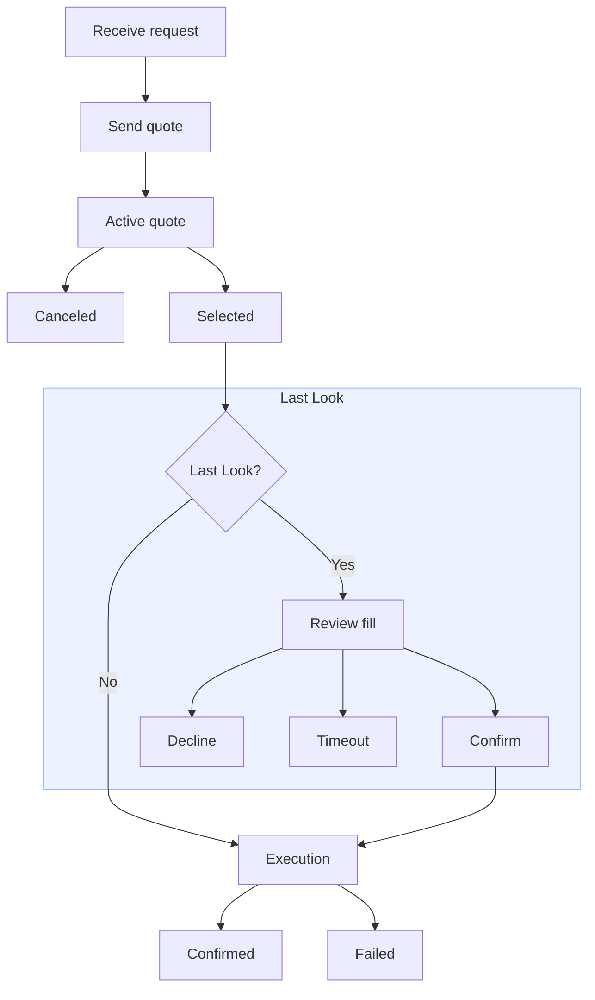

# Combos

> Build a market maker integration for pricing and executing Combos

Combos are multi-leg positions that combine multiple underlying market outcomes
into one YES or NO position. Each Combo is defined by its legs and identified by
derived YES and NO position IDs.

The request for quote (RFQ) system enables quote-based Combo execution between
two participants: Polymarket users (requesters) and market makers (quoters). A
user creates a Request, which starts an auction among connected market makers.
Market makers compete by submitting Quotes: executable prices they are willing to
fill.

```mermaid
sequenceDiagram
    autonumber
    participant Requester as Polymarket User
    participant RFQ as RFQ System
    participant Quoter as Market Maker
    participant Execution as Execution

    Requester->>RFQ: Request a Combo price
    RFQ->>Quoter: Send quote request
    activate Quoter
    Note right of Quoter: 400 ms max
    Quoter->>RFQ: Submit executable price
    deactivate Quoter
    RFQ->>Requester: Return best quote
    activate Requester
    Note left of Requester: 10 seconds max
    Requester->>RFQ: Accept quote
    deactivate Requester
    opt Last Look enabled
        RFQ->>Quoter: Request Last Look confirmation
        activate Quoter
        Note right of Quoter: 1 second max
        Quoter->>RFQ: Confirm fill
        deactivate Quoter
    end
    RFQ->>Execution: Execute accepted Combo
    Execution-->>Requester: Send execution update
    Execution-->>Quoter: Send execution update
    RFQ-->>Quoter: Broadcast confirmed trade
```



1. **User creates an unsigned Request** for a Combo price.
2. **RFQ system sends the Request** to connected market makers.
3. **Market makers submit signed Quotes** within the 400 ms submission window.
4. **RFQ system returns the best Quote** to the user.
5. **User accepts the Quote** by signing the trade within the 10-second
acceptance window.
6. **RFQ system requests Last Look confirmation** when Last Look is enabled.
7. **Market maker confirms or declines** within the 1-second confirmation window.
8. **RFQ system executes the accepted Combo**.
9. **User receives execution updates**.
10. **Market maker receives execution updates**.
11. **Connected market makers receive confirmed trade broadcasts**.

> **Note:** Combo position IDs are complementary to CLOB token IDs. A user can trade the market on the CLOB or can include the market as a leg of a Combo.

This guide shows market makers how to handle Combo RFQs. You will open a quoting
session, respond to incoming requests, cancel submitted quotes when needed,
confirm fills through Last Look, and monitor execution updates.

## Start Quoting

Start by preparing an authenticated quoting session with the RFQ system. You
need a Polymarket account; create one at [polymarket.com](https://polymarket.com).

**TypeScript**

### Install the Package
Install the Unified TypeScript SDK with the package manager of your choice.

```bash pnpm
pnpm add @polymarket/client@beta viem
```

```bash npm
npm install @polymarket/client@beta viem
```

```bash yarn
yarn add @polymarket/client@beta viem
```

> **Note:** This page uses Viem for wallet signing. See the [TypeScript tooling guide](/dev-tooling/typescript) for other wallet library integrations.

### Create a Secure Client
Create an instance of `SecureClient` with a wallet that has funds for fulfilling
user requests and its signer details.

```ts
import { createSecureClient, relayerApiKey } from "@polymarket/client";
import { privateKey } from "@polymarket/client/viem";

const client = await createSecureClient({
  wallet: process.env.POLYMARKET_WALLET_ADDRESS!,
  signer: privateKey(process.env.PRIVATE_KEY!),
  apiKey: relayerApiKey({
    key: process.env.RELAYER_API_KEY!,
    address: process.env.RELAYER_API_KEY_ADDRESS!,
  }),
});
```

The Relayer API key is necessary for setting up trading approvals in the next
step. Create a [Relayer API key](https://polymarket.com/settings?tab=api-keys)
from Settings > API Keys.

### Set Up Trading Approvals
Set up the approvals required to fill user requests.

```ts
await client.setupTradingApprovals();
```

### Open an RFQ Session
Open the RFQ session.

```ts
const session = await client.openRfqSession();

for await (const event of session) {
  // event: RfqEvent
}
```

### Close the Session
You can close the session at any time by calling `session.close()`.

```ts
for await (const event of session) {
  if (shouldCloseSession) {
    await session.close();
    break;
  }

  // …
}
```

**Python**

### Install the Package
Install the Python SDK with the package manager of your choice.

```bash uv
uv add polymarket-client
```

```bash pip
pip install polymarket-client
```

```bash poetry
poetry add polymarket-client
```

### Create a Secure Client
Create an `AsyncSecureClient` with a wallet that has funds for fulfilling user
requests and its signer details.

```python
import os

from polymarket import AsyncSecureClient, RelayerApiKey

client = await AsyncSecureClient.create(
    private_key=os.environ["PRIVATE_KEY"],
    wallet=os.environ["POLYMARKET_WALLET_ADDRESS"],
    api_key=RelayerApiKey(
        key=os.environ["RELAYER_API_KEY"],
        address=os.environ["RELAYER_API_KEY_ADDRESS"],
    ),
)
```

The Relayer API key is necessary for setting up trading approvals in the next
step. Create a [Relayer API key](https://polymarket.com/settings?tab=api-keys)
from Settings > API Keys.

### Set Up Trading Approvals
Set up the approvals required to fill user requests.

```python
await client.setup_trading_approvals()
```

### Open an RFQ Session
Open the RFQ session.

```python
async with client.open_rfq_session() as session:
    async for event in session:
        # event: RfqEvent
        ...
```

### Close the Session
You can close the session at any time by calling `await session.close()`.

```python
async with client.open_rfq_session() as session:
    async for event in session:
        if should_close_session:
            await session.close()
            break

        ...
```

**API**
> **Note:** Use Polygon mainnet chain ID `137` for CLOB authentication and Exchange v3 order signing.

### Open the WebSocket
Connect to the RFQ system WebSocket.

```text
wss://combos-rfq-gateway-quoter.polymarket.com/ws/rfq
```

To inspect the stream before integrating:

```bash
wscat -c "wss://combos-rfq-gateway-quoter.polymarket.com/ws/rfq"
```

Some write operations are also available through the REST API.

```text
https://combos-rfq-api.polymarket.com
```

### Acquire CLOB Credentials
RFQ WebSocket authentication uses CLOB API credentials: API key, secret, and
passphrase. If you need credentials, start with [Getting API
Credentials](/api-reference/authentication#using-the-rest-api).

### Resolve Quoter Identity
Resolve the order signer identity before sending `auth`. The RFQ system needs
the address that signs the order, the wallet that funds the order, and the
signature type that connects those two addresses.

| Wallet Type    | `signature_type` | `signer_address`              | `maker_address`      |
| -------------- | ---------------- | ----------------------------- | -------------------- |
| Deposit Wallet | `3` POLY\_1271   | Deposit wallet address        | Deposit wallet       |
| Safe Wallet    | `2` Safe         | Authenticated signing address | Derived Safe wallet  |
| Poly Proxy     | `1` Proxy        | Authenticated signing address | Derived proxy wallet |
| EOA            | `0` EOA          | EOA address                   | Same EOA address     |

For more detail, see [Signature Types and
Funder](/api-reference/authentication#signature-types-and-funder).

### Authenticate
Send `auth` as the first WebSocket message within 30 seconds. Include the CLOB
credentials and the `signer_address`, `maker_address`, and `signature_type`
values resolved in the previous step. This example uses a Deposit Wallet.

```json
{
  "type": "auth",
  "auth": {
    "apiKey": "YOUR_API_KEY",
    "secret": "YOUR_API_SECRET",
    "passphrase": "YOUR_API_PASSPHRASE"
  },
  "identity": {
    "signer_address": "<signer_address>",
    "maker_address": "<maker_address>",
    "signature_type": 3 // <signature_type>
  }
}
```

Authentication returns a success or failure response.

```json Success
{
  "type": "auth",
  "success": true,
  "address": "0xAuthenticatedAddress",
  "role": "maker"
}
```

```json Failure
{
  "type": "auth",
  "success": false,
  "error": "unauthenticated"
}
```

> **Note:** The RFQ system uses WebSocket protocol heartbeat frames to keep the connection alive. It sends a ping frame every 30 seconds with payload `rfq`; your client must respond with a pong frame that echoes the same payload. Most WebSocket clients handle this automatically. These are protocol frames, not JSON messages in the RFQ event stream. The gateway closes stale connections after 2 minutes without an inbound message or pong.

### Check Approval Requirements
Before posting quotes, `maker_address` must approve the contracts that may
transfer assets during RFQ execution.

| Approval                    | Required when                                 | Contract call                                           |
| --------------------------- | --------------------------------------------- | ------------------------------------------------------- |
| pUSD collateral             | The quoted order transfers pUSD               | `CollateralToken.approve(ExchangeV3, maxUint256)`       |
| Combo positions             | The quoted order transfers Combo positions    | `PositionManager.setApprovalForAll(ExchangeV3, true)`   |
| AutoRedeemer Combo operator | You want automatic redemption flows to use it | `PositionManager.setApprovalForAll(AutoRedeemer, true)` |

Use these contract addresses to build the approval calls.

| Contract              | Address                                      |
| --------------------- | -------------------------------------------- |
| pUSD collateral token | `0xC011a7E12a19f7B1f670d46F03B03f3342E82DFB` |
| Exchange v3           | `0xe3333700cA9d93003F00f0F71f8515005F6c00Aa` |
| PositionManager       | `0x006F54F7f9A22e0000CC2AB60031000000ae9fEF` |
| AutoRedeemer          | `0xa1200000d0002264C9a1698e001292D00E1b00af` |

> **Note:** The following steps show the Deposit Wallet [batch](/trading/deposit-wallets#submit-a-deposit-wallet-batch) path. If you are trading with an EOA, submit the approvals directly from `maker_address`. For Safe or Poly Proxy wallet flows, use an SDK.

### Build the Approval Call List
Encode the approval calls that are not already in place.

```solidity ERC-20 Approval
function approve(address spender, uint256 amount) returns (bool);
```

```solidity ERC-1155 Approval
function setApprovalForAll(address operator, bool approved);
```

Build a relayer call list from the encoded calldata.

```json
[
  {
    "target": "0xC011a7E12a19f7B1f670d46F03B03f3342E82DFB",
    "value": "0",
    "data": "<approve_exchange_v3_calldata>"
  },
  {
    "target": "0x006F54F7f9A22e0000CC2AB60031000000ae9fEF",
    "value": "0",
    "data": "<approve_exchange_v3_operator_calldata>"
  },
  {
    "target": "0x006F54F7f9A22e0000CC2AB60031000000ae9fEF",
    "value": "0",
    "data": "<approve_auto_redeemer_operator_calldata>"
  }
]
```

### Fetch the Nonce
Fetch a fresh `WALLET` nonce before signing the batch.

```bash
curl -G "https://relayer-v2.polymarket.com/v1/account/transactions/params" \
  -H "RELAYER_API_KEY: $RELAYER_API_KEY" \
  -H "RELAYER_API_KEY_ADDRESS: $RELAYER_API_KEY_ADDRESS" \
  --data-urlencode "address=$RELAYER_API_KEY_ADDRESS" \
  --data-urlencode "type=WALLET"
```

The response includes the nonce to sign with the transaction.

```json
{
  "address": "<RELAYER_API_KEY_ADDRESS>",
  "nonce": "<wallet_nonce>"
}
```

### Submit the Transaction
Build and sign a Deposit Wallet `Batch` with the owner. Use the approval calls
from the call-list step as `calls`.

```json EIP-712 Batch
{
  "domain": {
    "name": "DepositWallet",
    "version": "1",
    "chainId": 137,
    "verifyingContract": "<maker_address>"
  },
  "types": {
    "Call": [
      { "name": "target", "type": "address" },
      { "name": "value", "type": "uint256" },
      { "name": "data", "type": "bytes" }
    ],
    "Batch": [
      { "name": "wallet", "type": "address" },
      { "name": "nonce", "type": "uint256" },
      { "name": "deadline", "type": "uint256" },
      { "name": "calls", "type": "Call[]" }
    ]
  },
  "primaryType": "Batch",
  "message": {
    "wallet": "<maker_address>",
    "nonce": "<wallet_nonce>",
    "deadline": "<unix_seconds>",
    "calls": [
      {
        "target": "0xC011a7E12a19f7B1f670d46F03B03f3342E82DFB",
        "value": "0",
        "data": "<approval_calldata>"
      }
    ]
  }
}
```

Submit the signed batch to the relayer.

```bash
curl -X POST "https://relayer-v2.polymarket.com/submit" \
  -H "Content-Type: application/json" \
  -H "RELAYER_API_KEY: $RELAYER_API_KEY" \
  -H "RELAYER_API_KEY_ADDRESS: $RELAYER_API_KEY_ADDRESS" \
  -d '{
    "type": "WALLET",
    "from": "<relayer_api_key_address>",
    "to": "0x00000000000Fb5C9ADea0298D729A0CB3823Cc07",
    "nonce": "<wallet_nonce>",
    "signature": "<wallet_batch_signature>",
    "metadata": "Approve Combo RFQ contracts",
    "depositWalletParams": {
      "depositWallet": "<maker_address>",
      "deadline": "<unix_seconds>",
      "calls": [
        {
          "target": "0xC011a7E12a19f7B1f670d46F03B03f3342E82DFB",
          "value": "0",
          "data": "<approval_calldata>"
        }
      ]
    }
  }'
```

The response includes the relayer transaction ID.

```json
{
  "transactionID": "<transaction_id>",
  "state": "STATE_NEW"
}
```

### Poll the Transaction
Poll the relayer transaction until it reaches `STATE_CONFIRMED` before posting
quotes that rely on those approvals.

```bash
curl "https://relayer-v2.polymarket.com/v1/account/transactions/<transaction_id>" \
  -H "RELAYER_API_KEY: $RELAYER_API_KEY" \
  -H "RELAYER_API_KEY_ADDRESS: $RELAYER_API_KEY_ADDRESS"
```

```json
{
  "transaction_id": "<transaction_id>",
  "transaction_hash": "<transaction_hash>",
  "state": "STATE_CONFIRMED",
  "error_msg": null
}
```

Treat `STATE_FAILED` and `STATE_INVALID` as terminal failures.

## Handle Quote Requests

Quote requests describe a user's intent to buy or sell shares in a Combo defined
by a given set of legs. A quote request can currently only buy or sell the YES
side of a Combo.

The following cases show how a market maker can satisfy a user's buy or sell
request using collateral or inventory.

| Quote Request | Using Collateral      | From Inventory         |
| ------------- | --------------------- | ---------------------- |
| Buy YES       | Buy NO at `1 - price` | Sell YES at `price`    |
| Sell YES      | Buy YES at `price`    | Sell NO at `1 - price` |

See [Combinatorial Positions](/trading/ctf/combinatorial) for more detail on the
YES/NO position model.

The diagram below shows the maker-side quote lifecycle, from receiving a quote
request through its terminal outcome.



### Authorize the Quote

Authorize each quote by pricing the request and returning a signed order to the
RFQ system. Quoters should respond within the **400 ms** submission window.

**TypeScript**

### Switch on Event Type
First, switch on `event.type` to handle quote requests from the session stream.

```ts
switch (event.type) {
  case "quote_request":
    // event: RfqQuoteRequestEvent
    void handleQuoteRequest(event);
    break;

  // …
}
```

### Evaluate Request
Then, inspect the `RfqQuoteRequestEvent` before pricing it.

| Field                | Type                   | Description                                |
| -------------------- | ---------------------- | ------------------------------------------ |
| `rfqId`              | `RfqId`                | RFQ identifier used to correlate responses |
| `requestorPublicId`  | `RfqRequestorPublicId` | Public identifier for the user request     |
| `conditionId`        | `ComboConditionId`     | Derived Combo condition ID                 |
| `direction`          | `RfqDirection`         | Whether the user wants to buy or sell      |
| `side`               | `RfqSide.Yes`          | Currently always `RfqSide.Yes`             |
| `requestedSize`      | `RfqRequestedSize`     | User-requested notional or share size      |
| `yesPositionId`      | `PositionId`           | Derived YES Combo position ID              |
| `noPositionId`       | `PositionId`           | Derived NO Combo position ID               |
| `legPositionIds`     | `PositionId[]`         | Underlying leg position IDs                |
| `submissionDeadline` | `EpochMilliseconds`    | Unix-millisecond quote submission deadline |

`requestedSize` is an `RfqRequestedSize` value that describes how the user sized
the request.

```ts
type RfqRequestedSize =
  | {
      unit: RfqRequestedSizeUnit.Notional;
      value: DecimalString;
    }
  | {
      unit: RfqRequestedSizeUnit.Shares;
      value: DecimalString;
    };
```

Where:

* `notional`: the target value of the request in collateral currency. For
example, `"3"` means the user wants roughly 3 pUSD worth of the Combo, with the
resulting share size derived from the quote price.
* `shares`: the target number of Combo outcome tokens. For example, `"10"` means
the user wants 10 shares, or 10,000,000 base units.

In both cases, `value` is a normalized decimal string.

### Submission
Finally, handle pricing, quote submission, and persistence outside the session
loop before the `event.submissionDeadline` deadline. Price the request as pUSD
per YES Combo share; for example, `0.45` means `0.45` pUSD per share. If you do
not want to quote the request, skip submission.

```ts
async function handleQuoteRequest(event: RfqQuoteRequestEvent) {
  const price = priceComboRequest(event);

  if (price === undefined) return;

  const reference = await event.quote({ price });

  storeQuoteReference(reference);
}
```

**Python**

### Check Event Type
First, use `isinstance(...)` to handle quote requests from the session stream.

```python
from polymarket import RfqQuoteRequestEvent

async for event in session:
    if isinstance(event, RfqQuoteRequestEvent):
        await handle_quote_request(event)
```

### Evaluate Request
Then, inspect the `RfqQuoteRequestEvent` before pricing it.

| Field                 | Type                     | Description                                |
| --------------------- | ------------------------ | ------------------------------------------ |
| `rfq_id`              | `RfqId`                  | RFQ identifier used to correlate responses |
| `requestor_public_id` | `RfqRequestorPublicId`   | Public identifier for the user request     |
| `condition_id`        | `ComboConditionId`       | Derived Combo condition ID                 |
| `direction`           | `RfqDirection`           | Whether the user wants to buy or sell      |
| `side`                | `RfqSide`                | Currently always `RfqSide.YES`             |
| `requested_size`      | `RfqRequestedSize`       | User-requested notional or share size      |
| `yes_position_id`     | `PositionId`             | Derived YES Combo position ID              |
| `no_position_id`      | `PositionId`             | Derived NO Combo position ID               |
| `leg_position_ids`    | `tuple[PositionId, ...]` | Underlying leg position IDs                |
| `submission_deadline` | `int`                    | Unix-millisecond quote submission deadline |

`requested_size` is an `RfqRequestedSize` value that describes how the user sized
the request.

```python
from dataclasses import dataclass
from decimal import Decimal

from polymarket import RfqRequestedSizeUnit

@dataclass(frozen=True, slots=True, kw_only=True)
class RfqRequestedSize:
    unit: RfqRequestedSizeUnit
    value: Decimal
```

Where:

* `RfqRequestedSizeUnit.NOTIONAL`: the target value of the request in collateral
currency. For example, `Decimal("3")` means the user wants roughly 3 pUSD worth
of the Combo, with the resulting share size derived from the quote price.
* `RfqRequestedSizeUnit.SHARES`: the target number of Combo outcome tokens. For
example, `Decimal("10")` means the user wants 10 shares, or 10,000,000 base
units.

In both cases, `value` is a `Decimal`.

### Submission
Finally, handle pricing, quote submission, and persistence outside the session
loop before the `event.submission_deadline` deadline. Price the request as pUSD
per YES Combo share; for example, `Decimal("0.45")` means `0.45` pUSD per share.
If you do not want to quote the request, skip submission.

```python
from decimal import Decimal

from polymarket import RfqQuoteRequestEvent

async def handle_quote_request(event: RfqQuoteRequestEvent) -> None:
    price = price_combo_request(event)

    if price is None:
        return

    reference = await event.quote(price=price)

    store_quote_reference(reference)
```

**API**

### Receive the Quote Request
The RFQ system sends `RFQ_REQUEST` messages over the authenticated WebSocket.
Inspect the request before pricing it.

```json Notional Request
{
  "type": "RFQ_REQUEST",
  "rfq_id": "<rfq_id>",
  "requestor_public_id": "<requestor_public_id>",
  "leg_position_ids": ["<leg_position_id_1>", "<leg_position_id_2>"],
  "condition_id": "<condition_id>",
  "yes_position_id": "<yes_position_id>",
  "no_position_id": "<no_position_id>",
  "direction": "SELL",
  "side": "YES",
  "requested_size": {
    "unit": "notional",
    "value_e6": "1000000"
  },
  "submission_deadline": "<unix_milliseconds>"
}
```

```json Shares Request
{
  "type": "RFQ_REQUEST",
  "rfq_id": "<rfq_id>",
  "requestor_public_id": "<requestor_public_id>",
  "leg_position_ids": ["<leg_position_id_1>", "<leg_position_id_2>"],
  "condition_id": "<condition_id>",
  "yes_position_id": "<yes_position_id>",
  "no_position_id": "<no_position_id>",
  "direction": "SELL",
  "side": "YES",
  "requested_size": {
    "unit": "shares",
    "value_e6": "1000000"
  },
  "submission_deadline": "<unix_milliseconds>"
}
```

A `notional` request specifies a target pUSD amount; the fillable share size is
derived from the quote price. A `shares` request specifies the exact number of
Combo outcome tokens requested.

### Build the Order
Decide the `price` in base units for a full share. A full share is `1000000`
share base units, and `1` pUSD is `1000000` pUSD base units. For example, a
price of `0.45` pUSD per share means `price = 450000`.

Determine `size` from the request:

| `requested_size.unit` | `size`                                             |
| --------------------- | -------------------------------------------------- |
| `notional`            | `floor(requested_size.value_e6 * 1000000 / price)` |
| `shares`              | `requested_size.value_e6`                          |

Then determine the order token and amounts:

| Quote Request | Token             | `makerAmount`                              | `takerAmount` |
| ------------- | ----------------- | ------------------------------------------ | ------------- |
| `SELL` YES    | `yes_position_id` | `ceil(price * size / 1000000)`             | `size`        |
| `BUY` YES     | `no_position_id`  | `ceil((1000000 - price) * size / 1000000)` | `size`        |

The examples below quote `1` share, so `size = 1000000`.

```json SELL Request
{
  "salt": "<order_salt>",
  "maker": "<maker_address>",
  "signer": "<signer_address>",
  "tokenId": "<yes_position_id>",
  "makerAmount": "450000",
  "takerAmount": "1000000",
  "side": 0,
  "signatureType": 3, // <signature_type>
  "timestamp": "<unix_seconds>",
  "metadata": "0x0000000000000000000000000000000000000000000000000000000000000000",
  "builder": "0x0000000000000000000000000000000000000000000000000000000000000000"
}
```

```json BUY Request
{
  "salt": "<order_salt>",
  "maker": "<maker_address>",
  "signer": "<signer_address>",
  "tokenId": "<no_position_id>",
  "makerAmount": "550000",
  "takerAmount": "1000000",
  "side": 0,
  "signatureType": 3, // <signature_type>
  "timestamp": "<unix_seconds>",
  "metadata": "0x0000000000000000000000000000000000000000000000000000000000000000",
  "builder": "0x0000000000000000000000000000000000000000000000000000000000000000"
}
```

### Build EIP-712 Typed Data
Build the EIP-712 typed-data payload for your wallet type:

* Use `depositWalletTypedData` when `signature_type` is `3`.
* Use `exchangeV3OrderTypedData` when `signature_type` is `0`, `1`, or `2`.

```json depositWalletTypedData
{
  "domain": {
    "name": "Polymarket CTF Exchange",
    "version": "3",
    "chainId": 137,
    "verifyingContract": "0xe3333700cA9d93003F00f0F71f8515005F6c00Aa"
  },
  "types": {
    "Order": [
      { "name": "salt", "type": "uint256" },
      { "name": "maker", "type": "address" },
      { "name": "signer", "type": "address" },
      { "name": "tokenId", "type": "uint256" },
      { "name": "makerAmount", "type": "uint256" },
      { "name": "takerAmount", "type": "uint256" },
      { "name": "side", "type": "uint8" },
      { "name": "signatureType", "type": "uint8" },
      { "name": "timestamp", "type": "uint256" },
      { "name": "metadata", "type": "bytes32" },
      { "name": "builder", "type": "bytes32" }
    ],
    "TypedDataSign": [
      { "name": "contents", "type": "Order" },
      { "name": "name", "type": "string" },
      { "name": "version", "type": "string" },
      { "name": "chainId", "type": "uint256" },
      { "name": "verifyingContract", "type": "address" },
      { "name": "salt", "type": "bytes32" }
    ]
  },
  "primaryType": "TypedDataSign",
  "message": {
    "contents": {
      "salt": "<order_salt>",
      "maker": "<maker_address>",
      "signer": "<signer_address>",
      "tokenId": "<yes_position_id>",
      "makerAmount": "450000",
      "takerAmount": "1000000",
      "side": 0,
      "signatureType": 3, // <signature_type>
      "timestamp": "<unix_seconds>",
      "metadata": "0x0000000000000000000000000000000000000000000000000000000000000000",
      "builder": "0x0000000000000000000000000000000000000000000000000000000000000000"
    },
    "name": "DepositWallet",
    "version": "1",
    "chainId": 137,
    "verifyingContract": "0xYourDepositWallet",
    "salt": "0x0000000000000000000000000000000000000000000000000000000000000000"
  }
}
```

```json exchangeV3OrderTypedData
{
  "domain": {
    "name": "Polymarket CTF Exchange",
    "version": "3",
    "chainId": 137,
    "verifyingContract": "0xe3333700cA9d93003F00f0F71f8515005F6c00Aa"
  },
  "types": {
    "EIP712Domain": [
      { "name": "name", "type": "string" },
      { "name": "version", "type": "string" },
      { "name": "chainId", "type": "uint256" },
      { "name": "verifyingContract", "type": "address" }
    ],
    "Order": [
      { "name": "salt", "type": "uint256" },
      { "name": "maker", "type": "address" },
      { "name": "signer", "type": "address" },
      { "name": "tokenId", "type": "uint256" },
      { "name": "makerAmount", "type": "uint256" },
      { "name": "takerAmount", "type": "uint256" },
      { "name": "side", "type": "uint8" },
      { "name": "signatureType", "type": "uint8" },
      { "name": "timestamp", "type": "uint256" },
      { "name": "metadata", "type": "bytes32" },
      { "name": "builder", "type": "bytes32" }
    ]
  },
  "primaryType": "Order",
  "message": {
    "salt": "<order_salt>",
    "maker": "0xYourEoaAddress",
    "signer": "0xYourEoaAddress",
    "tokenId": "<yes_position_id>",
    "makerAmount": "450000",
    "takerAmount": "1000000",
    "side": 0,
    "signatureType": 0, // <signature_type>
    "timestamp": "<unix_seconds>",
    "metadata": "0x0000000000000000000000000000000000000000000000000000000000000000",
    "builder": "0x0000000000000000000000000000000000000000000000000000000000000000"
  }
}
```

Both payloads use the Exchange v3 EIP-712 domain. `exchangeV3OrderTypedData` is
the direct Exchange v3 `Order` payload. `depositWalletTypedData` is a
`TypedDataSign` wrapper whose `contents` field is the Exchange v3 order and
whose message includes the Deposit Wallet validation fields.

### Sign the Order
Sign the typed-data payload for the wallet type you authenticated with. The
normal Exchange v3 payload and the Deposit Wallet payload are different:

| Wallet Type    | `signatureType` | Payload to sign            | `signed_order.signature`       |
| -------------- | --------------- | -------------------------- | ------------------------------ |
| Deposit Wallet | `3`             | `depositWalletTypedData`   | ERC-7739-wrapped signature     |
| Safe Wallet    | `2`             | `exchangeV3OrderTypedData` | Standard 65-byte EVM signature |
| Poly Proxy     | `1`             | `exchangeV3OrderTypedData` | Standard 65-byte EVM signature |
| EOA            | `0`             | `exchangeV3OrderTypedData` | Standard 65-byte EVM signature |

The example below shows how to produce `signature` with Viem for both signing
paths.

```ts sign.ts
import { privateKeyToAccount } from "viem/accounts";
import { wrapDepositWalletSignature } from "./wrapDepositWalletSignature";

const signer = privateKeyToAccount("<SIGNER_PRIVATE_KEY>");

const signature =
  signatureType === 3
    ? wrapDepositWalletSignature(
        await signer.signTypedData(depositWalletTypedData),
        depositWalletTypedData,
      )
    : await signer.signTypedData(exchangeV3OrderTypedData);
```

```ts wrapDepositWalletSignature.ts
import {
  concatHex,
  encodeAbiParameters,
  keccak256,
  toHex,
  type Address,
  type Hex,
} from "viem";
import type { DepositWalletTypedData } from "./types";

const ORDER_TYPE =
  "Order(uint256 salt,address maker,address signer,uint256 tokenId,uint256 makerAmount,uint256 takerAmount,uint8 side,uint8 signatureType,uint256 timestamp,bytes32 metadata,bytes32 builder)";
const EIP712_DOMAIN_TYPE =
  "EIP712Domain(string name,string version,uint256 chainId,address verifyingContract)";

export function wrapDepositWalletSignature(
  innerSignature: Hex,
  depositWalletTypedData: DepositWalletTypedData,
): Hex {
  const order = depositWalletTypedData.message.contents;
  const exchangeV3Domain = depositWalletTypedData.domain;

  const appDomainSeparator = keccak256(
    encodeAbiParameters(
      [
        { type: "bytes32" },
        { type: "bytes32" },
        { type: "bytes32" },
        { type: "uint256" },
        { type: "address" },
      ],
      [
        keccak256(toHex(EIP712_DOMAIN_TYPE)),
        keccak256(toHex(exchangeV3Domain.name)),
        keccak256(toHex(exchangeV3Domain.version)),
        BigInt(exchangeV3Domain.chainId),
        exchangeV3Domain.verifyingContract,
      ],
    ),
  );
  const contentsHash = keccak256(
    encodeAbiParameters(
      [
        { type: "bytes32" },
        { type: "uint256" },
        { type: "address" },
        { type: "address" },
        { type: "uint256" },
        { type: "uint256" },
        { type: "uint256" },
        { type: "uint8" },
        { type: "uint8" },
        { type: "uint256" },
        { type: "bytes32" },
        { type: "bytes32" },
      ],
      [
        keccak256(toHex(ORDER_TYPE)),
        BigInt(order.salt),
        order.maker,
        order.signer,
        BigInt(order.tokenId),
        BigInt(order.makerAmount),
        BigInt(order.takerAmount),
        order.side,
        order.signatureType,
        BigInt(order.timestamp),
        order.metadata,
        order.builder,
      ],
    ),
  );

  return concatHex([
    innerSignature,
    appDomainSeparator,
    contentsHash,
    toHex(ORDER_TYPE),
    toHex(ORDER_TYPE.length, { size: 2 }),
  ]);
}
```

```ts types.ts
import type { Address, Hex } from "viem";

export type DepositWalletTypedData = {
  domain: {
    name: string;
    version: string;
    chainId: number;
    verifyingContract: Address;
  };
  message: {
    contents: {
      salt: string;
      maker: Address;
      signer: Address;
      tokenId: string;
      makerAmount: string;
      takerAmount: string;
      side: number;
      signatureType: number;
      timestamp: string;
      metadata: Hex;
      builder: Hex;
    };
  };
  types: Record<string, readonly { name: string; type: string }[]>;
  primaryType: "TypedDataSign";
};
```

### Submit the Quote
Before `submission_deadline`, submit the RFQ ID, quote price, fillable size, and
signed order. Add the signature from the previous step as
`signed_order.signature`.

```json WebSocket
{
  "type": "RFQ_QUOTE",
  "rfq_id": "<rfq_id>",
  "price_e6": "450000",
  "size_e6": "1000000",
  "signed_order": {
    "salt": "<order_salt>",
    "maker": "<maker_address>",
    "signer": "<signer_address>",
    "tokenId": "<yes_position_id>",
    "makerAmount": "450000",
    "takerAmount": "1000000",
    "side": 0,
    "signatureType": 3, // <signature_type>
    "timestamp": "<unix_seconds>",
    "metadata": "0x0000000000000000000000000000000000000000000000000000000000000000",
    "builder": "0x0000000000000000000000000000000000000000000000000000000000000000",
    "signature": "<signature>"
  }
}
```

```bash REST
curl -X POST "https://combos-rfq-api.polymarket.com/v1/maker/quotes" \
  -H "Content-Type: application/json" \
  -H "POLY_ADDRESS: <clob_credentials_address>" \
  -H "POLY_SIGNATURE: <clob_l2_signature>" \
  -H "POLY_TIMESTAMP: <timestamp>" \
  -H "POLY_API_KEY: <clob_api_key>" \
  -H "POLY_PASSPHRASE: <clob_passphrase>" \
  -d '{
    "quote_id": "<client_quote_id>",
    "rfq_id": "<rfq_id>",
    "signer_address": "<signer_address>",
    "maker_address": "<maker_address>",
    "signature_type": 3,
    "price_e6": "450000",
    "size_e6": "1000000",
    "signed_order": {
      "salt": "<order_salt>",
      "maker": "<maker_address>",
      "signer": "<signer_address>",
      "tokenId": "<yes_position_id>",
      "makerAmount": "450000",
      "takerAmount": "1000000",
      "side": 0,
      "signatureType": 3,
      "timestamp": "<unix_seconds>",
      "metadata": "0x0000000000000000000000000000000000000000000000000000000000000000",
      "builder": "0x0000000000000000000000000000000000000000000000000000000000000000",
      "signature": "<signature>"
    }
  }'
```

> **Note:** REST submissions require a client-generated `quote_id`. Use an opaque unique value; the RFQ system uses the `quote_` prefix followed by 32 lowercase hex characters.

### Store the Quote Reference
After submitting a quote, store the RFQ ID and quote ID together. WebSocket
submissions receive both values in the acknowledgement. REST submissions return
the current RFQ snapshot, so use the client-generated `quote_id` from the request.

```json WebSocket
{
  "type": "ACK_RFQ_QUOTE",
  "rfq_id": "<rfq_id>",
  "quote_id": "<quote_id>"
}
```

```json REST
{
  "request": {
    "rfq_id": "<rfq_id>"
    // …
  },
  "status": "COLLECTING_QUOTES",
  "competition_started_at": 1780963200000,
  "competition_ends_at": 1780963200400
}
```

This reference identifies the submitted quote.

### Quote Partial Fills

**TypeScript**
If you only want to fill part of the requested size, pass `size` with the quote.
`size` is a normalized decimal value: `"10"` means 10 shares, or 10,000,000 base
units. When omitted, the SDK quotes the full requested size.

```ts
await event.quote({
  price: "0.45",
  size: "10",
});
```

**Python**
If you only want to fill part of the requested size, pass `size` with the quote.
`size` is a `Decimal`-compatible value: `Decimal("10")` means 10 shares, or
10,000,000 base units. When omitted, the SDK quotes the full requested size.

```python
from decimal import Decimal

await event.quote(
    price=Decimal("0.45"),
    size=Decimal("10"),
)
```

**API**
Partial fills use the same signed-order flow as a full quote.

### Determine the Quote Size
Start by converting `requested_size` into the full request size in share base
units.

| `requested_size.unit` | Full request size                                  |
| --------------------- | -------------------------------------------------- |
| `notional`            | `floor(requested_size.value_e6 * 1000000 / price)` |
| `shares`              | `requested_size.value_e6`                          |

Choose a partial `size` in share base units that is smaller than the full request
size.

### Build the Partial Order
Compute the signed order amounts from the partial `size`.

| Quote Request | Token             | `makerAmount`                              | `takerAmount` |
| ------------- | ----------------- | ------------------------------------------ | ------------- |
| `SELL` YES    | `yes_position_id` | `ceil(price * size / 1000000)`             | `size`        |
| `BUY` YES     | `no_position_id`  | `ceil((1000000 - price) * size / 1000000)` | `size`        |

This example quotes half of a `1` share request at `0.45` pUSD per share, so
`size = 500000`:

```json SELL Request
{
  "salt": "<order_salt>",
  "maker": "<maker_address>",
  "signer": "<signer_address>",
  "tokenId": "<yes_position_id>",
  "makerAmount": "225000",
  "takerAmount": "500000",
  "side": 0,
  "signatureType": 3, // <signature_type>
  "timestamp": "<unix_seconds>",
  "metadata": "0x0000000000000000000000000000000000000000000000000000000000000000",
  "builder": "0x0000000000000000000000000000000000000000000000000000000000000000"
}
```

```json BUY Request
{
  "salt": "<order_salt>",
  "maker": "<maker_address>",
  "signer": "<signer_address>",
  "tokenId": "<no_position_id>",
  "makerAmount": "275000",
  "takerAmount": "500000",
  "side": 0,
  "signatureType": 3, // <signature_type>
  "timestamp": "<unix_seconds>",
  "metadata": "0x0000000000000000000000000000000000000000000000000000000000000000",
  "builder": "0x0000000000000000000000000000000000000000000000000000000000000000"
}
```

### Sign and Submit the Quote
Sign the partial order, then submit the quote.

```json
{
  "type": "RFQ_QUOTE",
  "rfq_id": "<rfq_id>",
  "price_e6": "450000",
  "size_e6": "500000",
  "signed_order": {
    "salt": "<order_salt>",
    "maker": "<maker_address>",
    "signer": "<signer_address>",
    "tokenId": "<yes_position_id>",
    "makerAmount": "225000",
    "takerAmount": "500000",
    "side": 0,
    "signatureType": 3, // <signature_type>
    "timestamp": "<unix_seconds>",
    "metadata": "0x0000000000000000000000000000000000000000000000000000000000000000",
    "builder": "0x0000000000000000000000000000000000000000000000000000000000000000",
    "signature": "<signature>"
  }
}
```

### Use Inventory

**TypeScript**
By default, quotes use collateral (pUSD) to buy YES or NO tokens as needed to
satisfy the quote request according to the combinatorial position logic. Pass
`source: "inventory"` when you want to quote from existing inventory instead.

```ts
await event.quote({
  price: "0.45",
  source: "inventory",
});
```

**Python**
By default, quotes use collateral (pUSD) to buy YES or NO tokens as needed to
satisfy the quote request according to the combinatorial position logic. Pass
`source=RfqQuoteSource.INVENTORY` when you want to quote from existing inventory
instead.

```python
from decimal import Decimal

from polymarket import RfqQuoteSource

await event.quote(
    price=Decimal("0.45"),
    source=RfqQuoteSource.INVENTORY,
)
```

**API**
Inventory quotes sell existing outcome tokens instead of spending collateral. The
RFQ quote price still means pUSD per YES Combo share.

### Choose the Inventory Token
Use the token you already hold for the side of the quote request.

| Quote Request | Inventory Token   | Order Side |
| ------------- | ----------------- | ---------- |
| `BUY` YES     | `yes_position_id` | SELL       |
| `SELL` YES    | `no_position_id`  | SELL       |

### Build the Inventory Order
Compute the signed order amounts from the inventory `size`.

| Quote Request | Order Price       | `makerAmount` | `takerAmount`                               |
| ------------- | ----------------- | ------------- | ------------------------------------------- |
| `BUY` YES     | `price`           | `size`        | `floor(price * size / 1000000)`             |
| `SELL` YES    | `1000000 - price` | `size`        | `floor((1000000 - price) * size / 1000000)` |

This example quotes `1` share at `0.45` pUSD per share, so `price = 450000` and
`size = 1000000`:

```json BUY Request
{
  "salt": "<order_salt>",
  "maker": "<maker_address>",
  "signer": "<signer_address>",
  "tokenId": "<yes_position_id>",
  "makerAmount": "1000000",
  "takerAmount": "450000",
  "side": 1,
  "signatureType": 3, // <signature_type>
  "timestamp": "<unix_seconds>",
  "metadata": "0x0000000000000000000000000000000000000000000000000000000000000000",
  "builder": "0x0000000000000000000000000000000000000000000000000000000000000000"
}
```

```json SELL Request
{
  "salt": "<order_salt>",
  "maker": "<maker_address>",
  "signer": "<signer_address>",
  "tokenId": "<no_position_id>",
  "makerAmount": "1000000",
  "takerAmount": "550000",
  "side": 1,
  "signatureType": 3, // <signature_type>
  "timestamp": "<unix_seconds>",
  "metadata": "0x0000000000000000000000000000000000000000000000000000000000000000",
  "builder": "0x0000000000000000000000000000000000000000000000000000000000000000"
}
```

### Sign and Submit the Quote
Sign the inventory order, then submit the quote.

```json
{
  "type": "RFQ_QUOTE",
  "rfq_id": "<rfq_id>",
  "price_e6": "450000",
  "size_e6": "1000000",
  "signed_order": {
    "salt": "<order_salt>",
    "maker": "<maker_address>",
    "signer": "<signer_address>",
    "tokenId": "<yes_position_id>",
    "makerAmount": "1000000",
    "takerAmount": "450000",
    "side": 1,
    "signatureType": 3, // <signature_type>
    "timestamp": "<unix_seconds>",
    "metadata": "0x0000000000000000000000000000000000000000000000000000000000000000",
    "builder": "0x0000000000000000000000000000000000000000000000000000000000000000",
    "signature": "<signature>"
  }
}
```

### Cancel Quotes

After you submit a quote, keep the returned quote reference. If your price,
inventory, or risk changes before the quote is selected, use that reference to
request cancellation.

> **Note:** A cancellation acknowledgement means the RFQ system processed the cancellation request. It does not guarantee the quote was withdrawn from an RFQ that was already selected.

**TypeScript**

### Store the Quote Reference
First, keep the quote reference returned by `event.quote(…)`. It contains the
`rfqId` and `quoteId` needed to cancel the quote.

```ts
const reference = await event.quote({ price: 0.45 });

// reference.rfqId: RfqId
// reference.quoteId: RfqQuoteId
```

### Cancel the Quote
Then, pass that reference to `session.cancelQuote(…)` on the same live RFQ
session.

```ts
if (shouldCancelQuote) {
  const ack = await session.cancelQuote(reference);

  // ack.rfqId: RfqId
  // ack.quoteId: RfqQuoteId
}
```

**Python**

### Store the Quote Reference
First, keep the quote reference returned by `event.quote(...)`. It contains the
`rfq_id` and `quote_id` needed to cancel the quote.

```python
from decimal import Decimal

reference = await event.quote(price=Decimal("0.45"))

# reference.rfq_id: RfqId
# reference.quote_id: RfqQuoteId
```

### Cancel the Quote
Then, pass that reference to `session.cancel_quote(...)` on the same live RFQ
session.

```python
if should_cancel_quote:
    ack = await session.cancel_quote(reference)

    # ack.rfq_id: RfqId
    # ack.quote_id: RfqQuoteId
```

**API**
Send a cancellation request with the RFQ ID and quote ID. On the WebSocket, the
RFQ system acknowledges a processed cancellation request with
`ACK_RFQ_QUOTE_CANCEL`.

```json Send
{
  "type": "RFQ_QUOTE_CANCEL",
  "rfq_id": "<rfq_id>",
  "quote_id": "<quote_id>",
  "signer_address": "<signer_address>",
  "maker_address": "<maker_address>"
}
```

```json Receive
{
  "type": "ACK_RFQ_QUOTE_CANCEL",
  "rfq_id": "<rfq_id>",
  "quote_id": "<quote_id>"
}
```

Alternatively, cancel the quote through the REST API.

```bash Request
curl -X POST "https://combos-rfq-api.polymarket.com/v1/maker/quotes/cancel" \
  -H "Content-Type: application/json" \
  -H "POLY_ADDRESS: <clob_credentials_address>" \
  -H "POLY_SIGNATURE: <clob_l2_signature>" \
  -H "POLY_TIMESTAMP: <timestamp>" \
  -H "POLY_API_KEY: <clob_api_key>" \
  -H "POLY_PASSPHRASE: <clob_passphrase>" \
  -d '{
    "rfq_id": "<rfq_id>",
    "quote_id": "<quote_id>",
    "signer_address": "<signer_address>",
    "maker_address": "<maker_address>",
    "signature_type": 3
  }'
```

```json Response
{
  "request": {
    "rfq_id": "<rfq_id>"
    // …
  },
  "status": "COLLECTING_QUOTES",
  "competition_started_at": 1780963200000,
  "competition_ends_at": 1780963200400
}
```

### Last Look

Last Look is a separate confirmation step for makers that have it enabled. If a
selected quote requires confirmation, run a final risk check before the
confirmation deadline and either confirm or decline the quote.

**TypeScript**

### Switch on the Event Type
First, switch on `event.type` to handle confirmation requests from the same
session stream.

```ts
switch (event.type) {
  case "confirmation_request":
    // event: RfqConfirmationRequestEvent
    void handleConfirmationRequest(event);
    break;

  // …
}
```

### Inspect the Confirmation Request
Then, inspect the confirmation request before running your final risk check. It
includes the selected quote, the final fill size, and the `event.confirmBy`
deadline for your Last Look response.

```ts
type RfqConfirmationRequestEvent = {
  type: "confirmation_request";
  rfqId: RfqId;
  quoteId: RfqQuoteId;
  conditionId: ComboConditionId;
  direction: RfqDirection;
  side: RfqSide.Yes;
  price: DecimalString;
  fillSize: DecimalString;
  yesPositionId: PositionId;
  noPositionId: PositionId;
  legPositionIds: PositionId[];
  confirmBy: EpochMilliseconds;
  confirm(): Promise<RfqConfirmationAck>;
  decline(): Promise<RfqConfirmationAck>;
};
```

### Confirm or Decline
Finally, run your final risk check outside the session loop and respond before
the `event.confirmBy` deadline.

```ts
async function handleConfirmationRequest(event: RfqConfirmationRequestEvent) {
  const canStillFill = runFinalRiskCheck(event);

  if (canStillFill) {
    await event.confirm();
    return;
  }

  await event.decline();
}
```

**Python**

### Check Event Type
First, use `isinstance(...)` to handle confirmation requests from the same
session stream.

```python
from polymarket import RfqConfirmationRequestEvent

async for event in session:
    if isinstance(event, RfqConfirmationRequestEvent):
        await handle_confirmation_request(event)
```

### Inspect the Confirmation Request
Then, inspect the confirmation request before running your final risk check. It
includes the selected quote, the final fill size, and the `event.confirm_by`
deadline for your Last Look response.

```python
class RfqConfirmationRequestEvent:
    type: "confirmation_request"
    rfq_id: RfqId
    quote_id: RfqQuoteId
    signer_address: EvmAddress
    maker_address: EvmAddress
    signature_type: int
    condition_id: ComboConditionId
    direction: RfqDirection
    side: RfqSide
    price: Decimal
    fill_size: Decimal
    yes_position_id: PositionId
    no_position_id: PositionId
    leg_position_ids: tuple[PositionId, ...]
    confirm_by: int

    async def confirm(self) -> RfqConfirmationAck: ...
    async def decline(self) -> RfqConfirmationAck: ...
```

### Confirm or Decline
Finally, run your final risk check outside the session loop and respond before
the `event.confirm_by` deadline.

```python
from polymarket import RfqConfirmationRequestEvent

async def handle_confirmation_request(
    event: RfqConfirmationRequestEvent,
) -> None:
    can_still_fill = run_final_risk_check(event)

    if can_still_fill:
        await event.confirm()
        return

    await event.decline()
```

**API**
If Last Look is enabled for your maker, the RFQ WebSocket sends
`RFQ_CONFIRMATION_REQUEST` after your quote is selected.

```json
{
  "type": "RFQ_CONFIRMATION_REQUEST",
  "rfq_id": "<rfq_id>",
  "quote_id": "<quote_id>",
  "signer_address": "<signer_address>",
  "maker_address": "<maker_address>",
  "signature_type": 3, // <signature_type>
  "leg_position_ids": ["<leg_position_id_1>", "<leg_position_id_2>"],
  "condition_id": "<combo_condition_id>",
  "yes_position_id": "<yes_position_id>",
  "no_position_id": "<no_position_id>",
  "direction": "BUY",
  "side": "YES",
  "fill_size_e6": "1000000",
  "price_e6": "450000",
  "confirm_by": 1780963200000
}
```

Respond before `confirm_by` with `CONFIRM` or `DECLINE`.

```json Confirm
{
  "type": "RFQ_CONFIRMATION_RESPONSE",
  "rfq_id": "<rfq_id>",
  "quote_id": "<quote_id>",
  "decision": "CONFIRM"
}
```

```json Decline
{
  "type": "RFQ_CONFIRMATION_RESPONSE",
  "rfq_id": "<rfq_id>",
  "quote_id": "<quote_id>",
  "decision": "DECLINE"
}
```

The RFQ system acknowledges the response with
`ACK_RFQ_CONFIRMATION_RESPONSE`.

```json
{
  "type": "ACK_RFQ_CONFIRMATION_RESPONSE",
  "rfq_id": "<rfq_id>",
  "quote_id": "<quote_id>",
  "decision": "CONFIRM"
}
```

Do not include `signer_address`, `maker_address`, or `signature_type` in
`RFQ_CONFIRMATION_RESPONSE`. The RFQ system applies identity from the
authenticated session.

Alternatively, send the Last Look decision through the REST API. The response
returns `execution` when your confirmation completes the bundle. If the RFQ is
still waiting on another maker confirmation, or if you decline, it returns
`snapshot`.

```bash Request
curl -X POST "https://combos-rfq-api.polymarket.com/v1/maker/confirmations" \
  -H "Content-Type: application/json" \
  -H "POLY_ADDRESS: <clob_credentials_address>" \
  -H "POLY_SIGNATURE: <clob_l2_signature>" \
  -H "POLY_TIMESTAMP: <timestamp>" \
  -H "POLY_API_KEY: <clob_api_key>" \
  -H "POLY_PASSPHRASE: <clob_passphrase>" \
  -d '{
    "rfq_id": "<rfq_id>",
    "quote_id": "<quote_id>",
    "signer_address": "<signer_address>",
    "maker_address": "<maker_address>",
    "signature_type": 3,
    "decision": "CONFIRM"
  }'
```

```json Execution Response
{
  "execution": {
    "execution_id": "<execution_id>",
    "quote_id": "<quote_id>",
    "request": {
      "rfq_id": "<rfq_id>"
    }
  }
}
```

```json Snapshot Response
{
  "snapshot": {
    "request": {
      "rfq_id": "<rfq_id>"
    },
    "status": "AWAITING_MAKER_CONFIRMATION"
  }
}
```

## Manage Combo Positions

Use Combo position workflows to manage inventory throughout the quote lifecycle.

### List Combo Positions

List Combo positions as part of your background inventory sync. Keep this state
fresh outside the quote path.

**TypeScript**
Use `client.listComboPositions(...)` to page through Combo positions for the
authenticated account. Filter by status, Combo condition ID, or Combo position
ID when you only need a subset of positions.

```ts
import { ComboPositionStatus, type ComboPosition } from "@polymarket/client";

const positions = client.listComboPositions({
  status: ComboPositionStatus.Open,
  pageSize: 50,
});

for await (const page of positions) {
  for (const position of page.items) {
    // position: ComboPosition
  }
}
```

Each returned item is a `ComboPosition`.

```ts ComboPosition
type ComboPosition = {
  conditionId: ComboConditionId;
  positionId: PositionId;
  moduleId: number;
  userAddress: Address;
  shares: DecimalString;
  entryAvgPriceUsdc?: DecimalString | null;
  entryCostUsdc?: DecimalString | null;
  status: ComboPositionStatus;
  firstEntryAt: IsoDateTimeString;
  resolvedAt?: IsoDateTimeString | null;
  legsTotal: number;
  legsResolved: number;
  legsPending: number;
  legs: ComboPositionLeg[];
};
```

```ts ComboPositionLeg
type ComboPositionLeg = {
  legIndex: number;
  legPositionId: PositionId;
  legConditionId: CtfConditionId;
  legOutcomeIndex: number;
  legOutcomeLabel?: string | null;
  legStatus: ComboPositionStatus;
  legResolvedAt?: IsoDateTimeString | null;
  legCurrentPrice?: DecimalString | null;
  market?: ComboPositionMarket | null;
};
```

```ts ComboPositionMarket
type ComboPositionMarket = {
  marketId?: string | null;
  slug?: string | null;
  title?: string | null;
  outcome?: string | null;
  imageUrl?: string | null;
  iconUrl?: string | null;
  category?: string | null;
  subcategory?: string | null;
  tags?: string[] | null;
  endDate?: IsoDateTimeString | null;
  event?: ComboPositionMarketEvent | null;
};
```

```ts ComboPositionMarketEvent
type ComboPositionMarketEvent = {
  eventId?: string | null;
  eventSlug?: string | null;
  eventTitle?: string | null;
  eventImage?: string | null;
};
```

You can filter positions by the following criteria:

```ts Condition ID
const positions = client.listComboPositions({
  conditionId: "<combo_condition_id>",
});
```

```ts Position ID
const positions = client.listComboPositions({
  positionId: "<yes_position_id|no_position_id>",
});
```

```ts Status
const positions = client.listComboPositions({
  status: ComboPositionStatus.Open,
});
```

**Python**
Use `client.list_combo_positions(...)` to page through Combo positions for the
authenticated wallet. The Python SDK returns snake\_case model fields and
`Decimal` values for numeric position amounts.

```python
positions = client.list_combo_positions(status="OPEN")

async for page in positions:
    for position in page.items:
        # position: ComboPosition
        ...
```

The returned `ComboPosition` models include the following fields:

```python ComboPosition
class ComboPosition:
    condition_id: ComboConditionId
    position_id: PositionId
    module_id: int
    user_address: EvmAddress
    shares: Decimal
    entry_avg_price_usdc: Decimal | None
    entry_cost_usdc: Decimal | None
    status: ComboPositionStatus
    first_entry_at: datetime
    resolved_at: datetime | None
    legs_total: int
    legs_resolved: int
    legs_pending: int
    legs: tuple[ComboPositionLeg, ...]
```

```python ComboPositionLeg
class ComboPositionLeg:
    leg_index: int
    leg_position_id: PositionId
    leg_condition_id: CtfConditionId
    leg_outcome_index: int
    leg_outcome_label: str | None
    leg_status: ComboPositionStatus
    leg_resolved_at: datetime | None
    leg_current_price: Decimal | None
    market: ComboPositionMarket | None
```

```python ComboPositionMarket
class ComboPositionMarket:
    market_id: str | None
    slug: str | None
    title: str | None
    outcome: str | None
    image_url: str | None
    icon_url: str | None
    category: str | None
    subcategory: str | None
    tags: tuple[str, ...] | None
    end_date: datetime | None
    event: ComboPositionMarketEvent | None
```

```python ComboPositionMarketEvent
class ComboPositionMarketEvent:
    event_id: str | None
    event_slug: str | None
    event_title: str | None
    event_image: str | None
```

You can filter positions by the following criteria:

```python Condition ID
positions = client.list_combo_positions(
    condition_id="<combo_condition_id>",
)
```

```python Position ID
positions = client.list_combo_positions(
    position_id="<yes_position_id|no_position_id>",
)
```

```python Status
positions = client.list_combo_positions(
    status="OPEN",
)
```

**API**
Use the Data API to list Combo positions for a wallet.

```bash
curl -G "https://data-api.polymarket.com/v1/positions/combos" \
  --data-urlencode "user=<maker_address>" \
  --data-urlencode "limit=50" \
  --data-urlencode "status=OPEN"
```

You can filter positions by the following query parameters:

```bash Condition ID
curl -G "https://data-api.polymarket.com/v1/positions/combos" \
  --data-urlencode "user=<maker_address>" \
  --data-urlencode "combo_condition_id=<combo_condition_id>"
```

```bash Position ID
curl -G "https://data-api.polymarket.com/v1/positions/combos" \
  --data-urlencode "user=<maker_address>" \
  --data-urlencode "combo_position_id=<yes_position_id|no_position_id>"
```

```bash Status
curl -G "https://data-api.polymarket.com/v1/positions/combos" \
  --data-urlencode "user=<maker_address>" \
  --data-urlencode "status=OPEN"
```

The response returns Combo positions in `combos` and pagination metadata in
`pagination`.

```json
{
  "combos": [
    {
      "combo_condition_id": "<combo_condition_id>",
      "combo_position_id": "<yes_position_id>",
      "module_id": 3,
      "user_address": "<maker_address>",
      "shares_balance": "10",
      "entry_avg_price_usdc": "0.45",
      "entry_cost_usdc": "4.5",
      "realized_payout_usdc": "0.00",
      "total_cost_usdc": "4.50",
      "status": "OPEN",
      "first_entry_at": "2026-06-08T00:00:00Z",
      "resolved_at": null,
      "legs_total": 2,
      "legs_resolved": 0,
      "legs_pending": 2,
      "legs": [
        {
          "leg_index": 0,
          "leg_position_id": "<leg_position_id_1>",
          "leg_condition_id": "<ctf_condition_id_1>",
          "leg_outcome_index": 0,
          "leg_outcome_label": "Yes",
          "leg_status": "OPEN",
          "leg_resolved_at": null,
          "leg_current_price": "0.52"
        }
      ]
    }
  ],
  "pagination": {
    "limit": 50,
    "offset": 0,
    "has_more": false,
    "next_cursor": null
  }
}
```

> **Note:** **Displaying closed (redeemed) positions.** `entry_cost_usdc` is the *remaining* cost basis (`entry_avg_price × shares_balance`), so it reads `~0` once a winning combo is redeemed — and `shares_balance` does too. Two fields carry the closed-position economics instead: * `realized_payout_usdc` — gross redemption proceeds (winning shares redeem 1:1 at \$1; accumulates under `PARTIAL`) * `total_cost_usdc` — original cost basis, reconstructed as `entry_avg_price × (shares_balance + realized_payout)` Net result of a finished combo = `realized_payout_usdc − total_cost_usdc`.

### Inventory Management

If you want to quote from inventory, build the inventory before quote requests
arrive. Splitting converts collateral into complementary Combo positions for a
set of legs. Merging converts matching complementary Combo positions back into
collateral.

**TypeScript**
Use `client.splitPosition(...)` with `legs` to create Combo inventory from
collateral. `amount` is in pUSD base units.

```ts
const split = await client.splitPosition({
  amount: 10_000_000n,
  legs: ["<leg_position_id_1>", "<leg_position_id_2>"],
});

const splitOutcome = await split.wait();

// splitOutcome.transactionHash identifies the confirmed split transaction.
```

Use `client.mergePositions(...)` with the same `legs` to merge complementary
Combo positions back into collateral. Pass `amount: "max"` to merge the largest
matching amount available.

```ts
const merge = await client.mergePositions({
  amount: "max",
  legs: ["<leg_position_id_1>", "<leg_position_id_2>"],
});

const mergeOutcome = await merge.wait();

// mergeOutcome.transactionHash identifies the confirmed merge transaction.
```

**Python**
Use `client.split_position(...)` with `legs` to create Combo inventory from
collateral. `amount` is in pUSD base units.

```python
split = await client.split_position(
    amount=10_000_000,
    legs=["<leg_position_id_1>", "<leg_position_id_2>"],
)

split_outcome = await split.wait()

# split_outcome.transaction_hash identifies the confirmed split transaction.
```

Use `client.merge_positions(...)` with the same `legs` to merge complementary
Combo positions back into collateral. Pass `amount="max"` to merge the largest
matching amount available.

```python
merge = await client.merge_positions(
    amount="max",
    legs=["<leg_position_id_1>", "<leg_position_id_2>"],
)

merge_outcome = await merge.wait()

# merge_outcome.transaction_hash identifies the confirmed merge transaction.
```

**API**
Use the Relayer API to split or merge Combo inventory by sending an ordered list
of encoded contract calls in one batch. The following steps assume you are using
a Deposit Wallet.

> **Note:** If you use a Safe or Poly Proxy wallet, use one of the SDKs instead because those wallet integrations require wallet-specific signing and encoding.

Use these contract addresses when building the call list.

| Contract              | Address                                      |
| --------------------- | -------------------------------------------- |
| CombinatorialModule   | `0x30000034706c7d8e12009dab006be20000c031a8` |
| Router                | `0x12121212006e4CD160D18e3f00711DA5c3372600` |
| PositionManager       | `0x006F54F7f9A22e0000CC2AB60031000000ae9fEF` |
| pUSD collateral token | `0xC011a7E12a19f7B1f670d46F03B03f3342E82DFB` |

### Check Approvals
First, determine whether the inventory action needs an approval. If approval is
already in place, skip this step.

For a split, `<maker_address>` must approve pUSD spending by the Router. For a
merge, `<maker_address>` must approve the Router as a PositionManager ERC-1155
operator.

```solidity ERC-20 Approval
function approve(address spender, uint256 amount) returns (bool);
```

```solidity ERC-1155 Approval
function setApprovalForAll(address operator, bool approved);
```

Encode one of these approval calls when needed. Keep the resulting call object;
it will be added before the Combo calls in the next step.

```json Split Approval Call
[
  {
    "target": "0xC011a7E12a19f7B1f670d46F03B03f3342E82DFB",
    "value": "0",
    "data": "<approve_calldata>"
  }
]
```

```json Merge Approval Call
[
  {
    "target": "0x006F54F7f9A22e0000CC2AB60031000000ae9fEF",
    "value": "0",
    "data": "<set_approval_for_all_calldata>"
  }
]
```

### Build the Call List
Then, add the Combo call objects to the ordered list.

For a split, include `prepareCondition` before `split`. `prepareCondition` is
idempotent, so it is safe to include even when the Combo condition was already
prepared. For a merge, call `merge` directly with the Combo condition ID for the
positions being merged.

```solidity
function prepareCondition(uint256[] legs) returns (bytes31);
function split(bytes31 conditionId, uint256 amount);
function merge(bytes31 conditionId, uint256 amount);
```

Append these encoded calls after the approval call from the previous step, if one
was needed.

```json Split Combo Calls
[
  // Include the approval call first when needed.
  // …
  {
    "target": "0x30000034706c7d8e12009dab006be20000c031a8",
    "value": "0",
    "data": "<prepare_condition_calldata>"
  },
  {
    "target": "0x12121212006e4CD160D18e3f00711DA5c3372600",
    "value": "0",
    "data": "<split_calldata>"
  }
]
```

```json Merge Combo Calls
[
  // Include the approval call first when needed.
  // …
  {
    "target": "0x12121212006e4CD160D18e3f00711DA5c3372600",
    "value": "0",
    "data": "<merge_calldata>"
  }
]
```

### Fetch the Nonce
Fetch a fresh `WALLET` nonce before each submission.

```bash
curl -G "https://relayer-v2.polymarket.com/v1/account/transactions/params" \
  -H "RELAYER_API_KEY: $RELAYER_API_KEY" \
  -H "RELAYER_API_KEY_ADDRESS: $RELAYER_API_KEY_ADDRESS" \
  --data-urlencode "address=$RELAYER_API_KEY_ADDRESS" \
  --data-urlencode "type=WALLET"
```

The response includes the nonce to sign with the transaction.

```json
{
  "address": "<RELAYER_API_KEY_ADDRESS>",
  "nonce": "<wallet_nonce>"
}
```

### Build the EIP-712 Batch
Build the Deposit Wallet EIP-712 `Batch` typed data.

```json
{
  "domain": {
    "name": "DepositWallet",
    "version": "1",
    "chainId": 137,
    "verifyingContract": "<maker_address>"
  },
  "types": {
    "Call": [
      { "name": "target", "type": "address" },
      { "name": "value", "type": "uint256" },
      { "name": "data", "type": "bytes" }
    ],
    "Batch": [
      { "name": "wallet", "type": "address" },
      { "name": "nonce", "type": "uint256" },
      { "name": "deadline", "type": "uint256" },
      { "name": "calls", "type": "Call[]" }
    ]
  },
  "primaryType": "Batch",
  "message": {
    "wallet": "<maker_address>",
    "nonce": "<wallet_nonce>",
    "deadline": "<unix_seconds>",
    "calls": [
      // Use the final calls array from the previous steps.
      // …
    ]
  }
}
```

Sign the EIP-712 batch with your signer. Use the resulting signature as
`signature` in the relayer submission.

### Submit the Transaction
Submit the signed transaction to the Relayer API.

```bash Split
curl -X POST "https://relayer-v2.polymarket.com/submit" \
  -H "Content-Type: application/json" \
  -H "RELAYER_API_KEY: $RELAYER_API_KEY" \
  -H "RELAYER_API_KEY_ADDRESS: $RELAYER_API_KEY_ADDRESS" \
  -d '{
    "type": "WALLET",
    "from": "<relayer_api_key_address>",
    "to": "0x00000000000Fb5C9ADea0298D729A0CB3823Cc07",
    "nonce": "<wallet_nonce>",
    "signature": "<wallet_batch_signature>",
    "metadata": "Split Combo position",
    "depositWalletParams": {
      "depositWallet": "<maker_address>",
      "deadline": "<unix_seconds>",
      "calls": [
        // Use the final calls array from the previous steps.
        // …
      ]
    }
  }'
```

```bash Merge
curl -X POST "https://relayer-v2.polymarket.com/submit" \
  -H "Content-Type: application/json" \
  -H "RELAYER_API_KEY: $RELAYER_API_KEY" \
  -H "RELAYER_API_KEY_ADDRESS: $RELAYER_API_KEY_ADDRESS" \
  -d '{
    "type": "WALLET",
    "from": "<relayer_api_key_address>",
    "to": "0x00000000000Fb5C9ADea0298D729A0CB3823Cc07",
    "nonce": "<wallet_nonce>",
    "signature": "<wallet_batch_signature>",
    "metadata": "Merge Combo positions",
    "depositWalletParams": {
      "depositWallet": "<maker_address>",
      "deadline": "<unix_seconds>",
      "calls": [
        // Use the final calls array from the previous steps.
        // …
      ]
    }
  }'
```

The response includes the relayer transaction ID.

```json
{
  "transactionID": "<transaction_id>",
  "state": "STATE_NEW"
}
```

### Poll the Transaction
Poll the relayer transaction until it reaches `STATE_CONFIRMED` before relying on
the updated inventory.

```bash
curl "https://relayer-v2.polymarket.com/v1/account/transactions/<transaction_id>" \
  -H "RELAYER_API_KEY: $RELAYER_API_KEY" \
  -H "RELAYER_API_KEY_ADDRESS: $RELAYER_API_KEY_ADDRESS"
```

```json
{
  "transaction_id": "<transaction_id>",
  "transaction_hash": "<transaction_hash>",
  "state": "STATE_CONFIRMED",
  "error_msg": null
}
```

Treat `STATE_FAILED` and `STATE_INVALID` as terminal failures.

### Redeem Resolved Positions

When a Combo position resolves, redeem the winning position to settle it back to
collateral.

**TypeScript**
Use `client.redeemPositions(...)` with a Combo `positionId`. The SDK redeems the
available balance for that resolved position.

```ts
const redeem = await client.redeemPositions({
  positionId: "<yes_position_id|no_position_id>",
});

const redeemOutcome = await redeem.wait();

// redeemOutcome.transactionHash identifies the confirmed redemption transaction.
```

You can list resolved winning positions first, then redeem each one.

```ts
import { ComboPositionStatus } from "@polymarket/client";

for await (const page of client.listComboPositions({
  status: ComboPositionStatus.ResolvedWin,
})) {
  for (const position of page.items) {
    const redeem = await client.redeemPositions({
      positionId: position.positionId,
    });

    await redeem.wait();
  }
}
```

**Python**
Use `client.redeem_positions(...)` with a Combo `position_id`. The SDK redeems
the available balance for that resolved position.

```python
redeem = await client.redeem_positions(
    position_id="<yes_position_id|no_position_id>",
)

redeem_outcome = await redeem.wait()

# redeem_outcome.transaction_hash identifies the confirmed redemption transaction.
```

You can list resolved winning positions first, then redeem each one.

```python
positions = client.list_combo_positions(status="RESOLVED_WIN")

async for position in positions.iter_items():
    redeem = await client.redeem_positions(
        position_id=position.position_id,
    )

    await redeem.wait()
```

**API**
Use the Relayer API to redeem resolved Combo positions by sending an ordered list
of encoded contract calls in one batch. The following steps assume you are using
a Deposit Wallet.

> **Note:** If you use a Safe or Poly Proxy wallet, use one of the SDKs instead because those wallet integrations require wallet-specific signing and encoding.

| Contract        | Address                                      |
| --------------- | -------------------------------------------- |
| Router          | `0x12121212006e4CD160D18e3f00711DA5c3372600` |
| PositionManager | `0x006F54F7f9A22e0000CC2AB60031000000ae9fEF` |

### Check Approval
First, determine whether `<maker_address>` has approved the Router as a
PositionManager ERC-1155 operator. If approval is already in place, skip this
step.

```solidity
function setApprovalForAll(address operator, bool approved);
```

Encode the approval call when needed. The approval call becomes the first object
in the final `calls` array.

```json
[
  {
    "target": "0x006F54F7f9A22e0000CC2AB60031000000ae9fEF",
    "value": "0",
    "data": "<set_approval_for_all_calldata>"
  }
]
```

### Determine Redeem Inputs
Set the Router inputs for the redemption.

| Value          | Source                                |
| -------------- | ------------------------------------- |
| `conditionId`  | `<combo_condition_id>`                |
| `outcomeIndex` | `0` for YES, `1` for NO               |
| `amount`       | Shares to redeem, in share base units |

The Router accepts `conditionId`, `outcomeIndex`, and `amount`, not `positionId`.

### Build the Call List
The Router redeem function is:

```solidity
function redeem(bytes31 conditionId, uint256 outcomeIndex, uint256 amount);
```

Append the redeem call after the approval call from the previous step, if one was
needed.

```json Redeem Calls
[
  // Include the approval call first when needed.
  // …
  {
    "target": "0x12121212006e4CD160D18e3f00711DA5c3372600",
    "value": "0",
    "data": "<redeem_calldata>"
  }
]
```

### Fetch the Nonce
Fetch a fresh `WALLET` nonce before each submission.

```bash
curl -G "https://relayer-v2.polymarket.com/v1/account/transactions/params" \
  -H "RELAYER_API_KEY: $RELAYER_API_KEY" \
  -H "RELAYER_API_KEY_ADDRESS: $RELAYER_API_KEY_ADDRESS" \
  --data-urlencode "address=$RELAYER_API_KEY_ADDRESS" \
  --data-urlencode "type=WALLET"
```

The response includes the nonce to sign with the transaction.

```json
{
  "address": "<RELAYER_API_KEY_ADDRESS>",
  "nonce": "<wallet_nonce>"
}
```

### Build the EIP-712 Batch
Build the Deposit Wallet EIP-712 `Batch` typed data.

```json
{
  "domain": {
    "name": "DepositWallet",
    "version": "1",
    "chainId": 137,
    "verifyingContract": "<maker_address>"
  },
  "types": {
    "Call": [
      { "name": "target", "type": "address" },
      { "name": "value", "type": "uint256" },
      { "name": "data", "type": "bytes" }
    ],
    "Batch": [
      { "name": "wallet", "type": "address" },
      { "name": "nonce", "type": "uint256" },
      { "name": "deadline", "type": "uint256" },
      { "name": "calls", "type": "Call[]" }
    ]
  },
  "primaryType": "Batch",
  "message": {
    "wallet": "<maker_address>",
    "nonce": "<wallet_nonce>",
    "deadline": "<unix_seconds>",
    "calls": [
      // Use the final calls array from the previous steps.
      // …
    ]
  }
}
```

Sign the EIP-712 batch with your signer. Use the resulting signature as
`signature` in the relayer submission.

### Submit the Transaction
Submit the signed transaction to the Relayer API.

```bash
curl -X POST "https://relayer-v2.polymarket.com/submit" \
  -H "Content-Type: application/json" \
  -H "RELAYER_API_KEY: $RELAYER_API_KEY" \
  -H "RELAYER_API_KEY_ADDRESS: $RELAYER_API_KEY_ADDRESS" \
  -d '{
    "type": "WALLET",
    "from": "<relayer_api_key_address>",
    "to": "0x00000000000Fb5C9ADea0298D729A0CB3823Cc07",
    "nonce": "<wallet_nonce>",
    "signature": "<wallet_batch_signature>",
    "metadata": "Redeem Combo position",
    "depositWalletParams": {
      "depositWallet": "<maker_address>",
      "deadline": "<unix_seconds>",
      "calls": [
        // Use the final calls array from the previous steps.
        // …
      ]
    }
  }'
```

The response includes the relayer transaction ID.

```json
{
  "transactionID": "<transaction_id>",
  "state": "STATE_NEW"
}
```

### Poll the Transaction
Poll the relayer transaction until it reaches `STATE_CONFIRMED` before relying on
the redeemed balance.

```bash
curl "https://relayer-v2.polymarket.com/v1/account/transactions/<transaction_id>" \
  -H "RELAYER_API_KEY: $RELAYER_API_KEY" \
  -H "RELAYER_API_KEY_ADDRESS: $RELAYER_API_KEY_ADDRESS"
```

```json
{
  "transaction_id": "<transaction_id>",
  "transaction_hash": "<transaction_hash>",
  "state": "STATE_CONFIRMED",
  "error_msg": null
}
```

Treat `STATE_FAILED` and `STATE_INVALID` as terminal failures.

## Get Combo Markets

Use the Combo markets catalog to retrieve active markets that can be used as
Combo legs. Markets are ordered by volume descending.

**TypeScript**
Use `client.listComboMarkets(...)` to page through markets that can be used as
Combo legs.

```ts
const paginator = client.listComboMarkets({ pageSize: 50 });

for await (const page of paginator) {
  // page.items: ComboMarket[]
}
```

Use `exclude` to omit markets you have already shown or selected.

```ts
const paginator = client.listComboMarkets({
  exclude: selectedConditionIds,
  pageSize: 50,
});
```

The SDK returns structured YES and NO outcomes.

```ts
type ComboMarket = {
  id: MarketId;
  conditionId: CtfConditionId;
  slug: string;
  title: string;
  outcomes: {
    yes: {
      label: string;
      positionId: PositionId;
      price: DecimalString;
    };
    no: {
      label: string;
      positionId: PositionId;
      price: DecimalString;
    };
  };
  image: string;
  volume: number;
  tags: string[];
};
```

**Python**
Use `client.list_combo_markets(...)` to page through markets that can be used as
Combo legs.

```python
paginator = client.list_combo_markets(page_size=50)

async for market in paginator.iter_items():
    print(market.title, market.outcomes.yes.position_id)
```

Use `exclude` to omit markets you have already shown or selected.

```python
paginator = client.list_combo_markets(
    exclude=selected_condition_ids,
    page_size=50,
)
```

The SDK returns structured YES and NO outcomes with snake\_case fields.

```python
yes_position_id = market.outcomes.yes.position_id
yes_price = market.outcomes.yes.price
no_position_id = market.outcomes.no.position_id
no_price = market.outcomes.no.price
```

**API**
Fetch the first page of Combo-enabled markets.

```bash
curl -G "https://combos-rfq-api.polymarket.com/v1/rfq/combo-markets" \
  --data-urlencode "limit=50"
```

Use `cursor` to fetch the next page, and use `exclude` to omit markets you have
already shown or selected.

```bash
curl -G "https://combos-rfq-api.polymarket.com/v1/rfq/combo-markets" \
  --data-urlencode "limit=50" \
  --data-urlencode "cursor=<next_cursor>" \
  --data-urlencode "exclude=<condition_id_1>,<condition_id_2>"
```

The response includes markets and an opaque `next_cursor`. A `null` cursor means
there are no more pages.

```json
{
  "markets": [
    {
      "id": "1897034",
      "condition_id": "0x4cd7...110ff",
      "position_ids": ["1012585...362880", "1012585...362881"],
      "slug": "fifwc-mex-rsa-2026-06-11-mex",
      "title": "Will Mexico win on 2026-06-11?",
      "outcomes": ["Yes", "No"],
      "outcome_prices": ["0.685", "0.315"],
      "image": "https://...",
      "volume": 330327.7128580074,
      "tags": ["sports", "soccer", "games", "world-cup"]
    }
  ],
  "next_cursor": "Mg"
}
```

For each market, `position_ids`, `outcomes`, and `outcome_prices` are aligned by
array index. Index `0` is the YES outcome, and index `1` is the NO outcome.

## Map Legs to Markets

Market makers should build their own view of the markets that support Combos
before quote requests arrive. Combo-enabled markets expose a list of position
IDs with two entries: the first is the YES position ID and the second is the NO
position ID. These IDs identify the outcome positions your pricing system can map
back to market data.

**TypeScript**
Fetch non-closed markets and index them by position ID in your own market data
store.

```ts
for await (const page of client.listMarkets({ closed: false })) {
  for (const market of page.items) {
    for (const positionId of market.positionIds) {
      marketByPositionId.set(positionId, market);
    }
  }
}
```

You can also fetch markets by leg position ID on demand, but most market makers
will want this context ready before the **400 ms** quote window starts.

```ts
const page = await client
  .listMarkets({
    positionIds: event.legPositionIds,
  })
  .firstPage();

const markets = page.items;
```

**Python**
Fetch non-closed markets and index them by position ID in your own market data
store.

```python
async for market in client.list_markets(closed=False).iter_items():
    for position_id in market.position_ids:
        market_by_position_id[position_id] = market
```

You can also fetch markets by leg position ID on demand, but most market makers
will want this context ready before the **400 ms** quote window starts.

```python
page = await client.list_markets(
    position_ids=event.leg_position_ids,
).first_page()

markets = page.items
```

**API**
Use Gamma `GET /markets` to resolve Combo leg position IDs into market metadata.
Build this mapping outside the quote path.

```bash
curl -G "https://gamma-api.polymarket.com/markets" \
  --data-urlencode "closed=false" \
  --data-urlencode "limit=100"
```

Index every returned market by `positionIds`.

```json
{
  "id": "<market_id>",
  "conditionId": "<ctf_condition_id>",
  "question": "Will example happen?",
  "positionIds": ["<yes_leg_position_id>", "<no_leg_position_id>"]
}
```

You can also resolve markets by leg position ID on demand, but avoid doing this
inside the **400 ms** quote window.

```bash
curl -G "https://gamma-api.polymarket.com/markets" \
  --data-urlencode "position_ids=<leg_position_id_1>" \
  --data-urlencode "position_ids=<leg_position_id_2>"
```

## Listen to Execution Updates

Execution updates tell you what happened after one of your quotes was selected.
Use them to reconcile RFQ state, transaction hashes, and terminal execution
outcomes in your own systems.

**TypeScript**

### Switch on the Event Type
First, switch on `event.type` to handle execution updates from the same session
stream.

```ts
switch (event.type) {
  case "execution_update":
    // event: RfqExecutionUpdateEvent
    handleExecutionUpdate(event);
    break;

  // …
}
```

### Inspect the Execution Update
Then, inspect the execution update before reconciling the selected RFQ. Execution
updates are correlated by `rfqId`.

```ts
type RfqExecutionUpdateEvent = {
  type: "execution_update";
  rfqId: RfqId;
  status: RfqExecutionStatus;
  txHash?: TxHash;
};
```

where `RfqExecutionStatus` could be:

| Status                         | Meaning                                           |
| ------------------------------ | ------------------------------------------------- |
| `RfqExecutionStatus.Matched`   | The quote was selected and handed off to execute. |
| `RfqExecutionStatus.Mined`     | The execution transaction was mined.              |
| `RfqExecutionStatus.Retrying`  | Execution is being retried.                       |
| `RfqExecutionStatus.Confirmed` | Execution completed successfully.                 |
| `RfqExecutionStatus.Failed`    | Execution failed.                                 |

### Reconcile Execution State
Finally, persist the update and treat `RfqExecutionStatus.Confirmed` and
`RfqExecutionStatus.Failed` as terminal states.

```ts
function handleExecutionUpdate(event: RfqExecutionUpdateEvent) {
  storeExecutionUpdate(event);

  if (event.status === RfqExecutionStatus.Confirmed) {
    markQuoteConfirmed(event.rfqId);
    return;
  }

  if (event.status === RfqExecutionStatus.Failed) {
    markQuoteFailed(event.rfqId);
  }
}
```

**Python**

### Check Event Type
First, use `isinstance(...)` to handle execution updates from the same session
stream.

```python
from polymarket import RfqExecutionUpdateEvent

async for event in session:
    if isinstance(event, RfqExecutionUpdateEvent):
        handle_execution_update(event)
```

### Inspect the Execution Update
Then, inspect the execution update before reconciling the selected RFQ. Execution
updates are correlated by `rfq_id`.

```python
class RfqExecutionUpdateEvent:
    type: "execution_update"
    rfq_id: RfqId
    status: RfqExecutionStatus
    tx_hash: TransactionHash | None
```

where `RfqExecutionStatus` could be:

| Status                         | Meaning                                           |
| ------------------------------ | ------------------------------------------------- |
| `RfqExecutionStatus.MATCHED`   | The quote was selected and handed off to execute. |
| `RfqExecutionStatus.MINED`     | The execution transaction was mined.              |
| `RfqExecutionStatus.RETRYING`  | Execution is being retried.                       |
| `RfqExecutionStatus.CONFIRMED` | Execution completed successfully.                 |
| `RfqExecutionStatus.FAILED`    | Execution failed.                                 |

### Reconcile Execution State
Finally, persist the update and treat `RfqExecutionStatus.CONFIRMED` and
`RfqExecutionStatus.FAILED` as terminal states.

```python
from polymarket import RfqExecutionStatus, RfqExecutionUpdateEvent

def handle_execution_update(event: RfqExecutionUpdateEvent) -> None:
    store_execution_update(event)

    if event.status is RfqExecutionStatus.CONFIRMED:
        mark_quote_confirmed(event.rfq_id)
        return

    if event.status is RfqExecutionStatus.FAILED:
        mark_quote_failed(event.rfq_id)
```

**API**
Listen for `RFQ_EXECUTION_UPDATE` messages on the RFQ WebSocket after one of your
quotes is selected.

```json
{
  "type": "RFQ_EXECUTION_UPDATE",
  "rfq_id": "<rfq_id>",
  "status": "MINED",
  "tx_hash": "<transaction_hash>"
}
```

Execution updates are correlated by `rfq_id`.

| Status      | Meaning                                           |
| ----------- | ------------------------------------------------- |
| `MATCHED`   | The quote was selected and handed off to execute. |
| `MINED`     | The execution transaction was mined.              |
| `RETRYING`  | Execution is being retried.                       |
| `CONFIRMED` | Execution completed successfully.                 |
| `FAILED`    | Execution failed.                                 |

Treat `CONFIRMED` and `FAILED` as terminal states.

## Listen to Trade Broadcasts

Confirmed trade broadcasts tell connected market makers when any Combo RFQ trade
has completed successfully. Use them to build a public trade tape, update risk,
or reconcile market activity that was filled by another maker.

Trade broadcasts are best-effort and may be replayed after reconnects. Deduplicate
them by RFQ ID: `rfqId` in TypeScript or `rfq_id` in Python and raw WebSocket
messages.

**TypeScript**

### Switch on the Event Type
First, switch on `event.type` to handle trade broadcasts from the same session
stream.

```ts
switch (event.type) {
  case "trade":
    // event: RfqTradeEvent
    handleTrade(event);
    break;

  // …
}
```

### Inspect the Trade
Then, inspect the confirmed trade before storing or applying it. Trade broadcasts
exclude maker identity and per-maker fill allocations.

```ts
type RfqTradeEvent = {
  type: "trade";
  rfqId: RfqId;
  requesterId: RfqRequestorPublicId;
  conditionId: ComboConditionId;
  legPositionIds: PositionId[];
  direction: RfqDirection;
  side: RfqSide.Yes;
  price: DecimalString;
  size: DecimalString;
  executedAt: EpochMilliseconds;
};
```

`price` is the accepted blended price in pUSD per YES Combo share. `size` is the
matched Combo share size. Both values are normalized decimal strings.

### Store the Trade
Finally, persist the trade by RFQ ID and execution timestamp for downstream
reconciliation.

```ts
function handleTrade(event: RfqTradeEvent) {
  storeComboTrade({
    rfqId: event.rfqId,
    conditionId: event.conditionId,
    legPositionIds: event.legPositionIds,
    requesterId: event.requesterId,
    price: event.price,
    size: event.size,
    executedAt: event.executedAt,
  });
}
```

**Python**

### Check Event Type
First, use `isinstance(...)` to handle trade broadcasts from the same session
stream.

```python
from polymarket import RfqTradeEvent

async for event in session:
    if isinstance(event, RfqTradeEvent):
        handle_trade(event)
```

### Inspect the Trade
Then, inspect the confirmed trade before storing or applying it. Trade broadcasts
exclude maker identity and per-maker fill allocations.

```python
from decimal import Decimal

class RfqTradeEvent:
    type: "trade"
    rfq_id: RfqId
    requester_id: RfqRequestorPublicId
    condition_id: ComboConditionId
    leg_position_ids: tuple[PositionId, ...]
    direction: RfqDirection
    side: RfqSide
    price: Decimal
    size: Decimal
    executed_at: int
```

`price` is the accepted blended price in pUSD per YES Combo share. `size` is the
matched Combo share size. Both values are `Decimal` instances.

### Store the Trade
Finally, persist the trade by RFQ ID and execution timestamp for downstream
reconciliation.

```python
from polymarket import RfqTradeEvent

def handle_trade(event: RfqTradeEvent) -> None:
    store_combo_trade(
        rfq_id=event.rfq_id,
        condition_id=event.condition_id,
        leg_position_ids=event.leg_position_ids,
        requester_id=event.requester_id,
        price=event.price,
        size=event.size,
        executed_at=event.executed_at,
    )
```

**API**
Listen for `RFQ_TRADE` messages on the RFQ WebSocket after Combo executions are
confirmed. These messages are sent to authenticated quoter sessions and exclude
maker identity and per-maker fill allocations.

```json
{
  "type": "RFQ_TRADE",
  "rfq_id": "<rfq_id>",
  "requester_id": "<requester_id>",
  "condition_id": "<combo_condition_id>",
  "leg_position_ids": ["<leg_position_id_1>", "<leg_position_id_2>"],
  "direction": "BUY",
  "side": "YES",
  "price_e6": "125000",
  "size_e6": "800000",
  "executed_at": 1780854786039
}
```

`price_e6` is the accepted blended price in 6-decimal base units, and `size_e6`
is the matched Combo share size in 6-decimal base units.

## Handle Errors

In this section, we will talk you through how to handle errors with the RFQ system.

**TypeScript**
### Open the RFQ Session

Wrap `client.openRfqSession()` in `try`/`catch` and use
`OpenRfqSessionError.isError(…)` to narrow the error type.

```ts
try {
  const session = await client.openRfqSession();
} catch (error) {
  if (!OpenRfqSessionError.isError(error)) throw error;

  switch (error.name) {
    case "TransportError":
      // error: TransportError
      break;
  }
}
```

### Submit a Quote

Wrap `event.quote(…)` in `try`/`catch` and use `RfqQuoteError.isError(…)` to
narrow the error type.

```ts
try {
  const reference = await event.quote({ price });
  // …
} catch (error) {
  if (!RfqQuoteError.isError(error)) throw error;

  switch (error.name) {
    case "RfqQuoteRejectedError":
      // error: RfqQuoteRejectedError
      // error.rfqId: RfqId
      // error.code: RfqErrorCode | undefined
      break;
    case "SigningError":
      // error: SigningError
      break;
    case "TimeoutError":
      // error: TimeoutError
      break;
    case "TransportError":
      // error: TransportError
      break;
    case "UserInputError":
      // error: UserInputError
      break;
  }
}
```

### Cancel a Quote

Wrap `session.cancelQuote(…)` in `try`/`catch` and use
`RfqCancelQuoteError.isError(…)` to narrow the error type.

```ts
try {
  const ack = await session.cancelQuote(reference);
  // …
} catch (error) {
  if (!RfqCancelQuoteError.isError(error)) throw error;

  switch (error.name) {
    case "RfqCancelQuoteRejectedError":
      // error: RfqCancelQuoteRejectedError
      // error.rfqId: RfqId
      // error.quoteId: RfqQuoteId
      // error.code: RfqErrorCode | undefined
      break;
    case "TimeoutError":
      // error: TimeoutError
      break;
    case "TransportError":
      // error: TransportError
      break;
  }
}
```

### Confirm or Decline

Wrap `event.confirm()` or `event.decline()` in `try`/`catch` and use
`RfqConfirmationError.isError(…)` to narrow the error type.

```ts
try {
  if (canStillFill) {
    await event.confirm();
  } else {
    await event.decline();
  }
} catch (error) {
  if (!RfqConfirmationError.isError(error)) throw error;

  switch (error.name) {
    case "RfqConfirmationRejectedError":
      // error: RfqConfirmationRejectedError
      // error.rfqId: RfqId
      // error.quoteId: RfqQuoteId
      // error.code: RfqErrorCode | undefined
      break;
    case "TimeoutError":
      // error: TimeoutError
      break;
    case "TransportError":
      // error: TransportError
      break;
  }
}
```

**Python**
### Open the RFQ Session

Wrap `client.open_rfq_session()` in `try`/`except` and catch SDK exception types.

```python
from polymarket import TimeoutError, TransportError

try:
    async with client.open_rfq_session() as session:
        async for event in session:
            ...
except TimeoutError as error:
    # error: TimeoutError
    ...
except TransportError as error:
    # error: TransportError
    ...
```

### Submit a Quote

Wrap `event.quote(...)` in `try`/`except` and catch the typed RFQ rejection,
timeout, and transport errors.

```python
from decimal import Decimal

from polymarket import RfqQuoteRejectedError, TimeoutError, TransportError

try:
    reference = await event.quote(price=Decimal("0.45"))
except RfqQuoteRejectedError as error:
    # error.rfq_id: RfqId
    # error.code: RfqErrorCode | None
    ...
except TimeoutError as error:
    # error: TimeoutError
    ...
except TransportError as error:
    # error: TransportError
    ...
```

### Cancel a Quote

Wrap `session.cancel_quote(...)` in `try`/`except` and catch the typed RFQ
cancellation rejection, timeout, and transport errors.

```python
from polymarket import RfqCancelQuoteRejectedError, TimeoutError, TransportError

try:
    ack = await session.cancel_quote(reference)
except RfqCancelQuoteRejectedError as error:
    # error.rfq_id: RfqId
    # error.quote_id: RfqQuoteId
    # error.code: RfqErrorCode | None
    ...
except TimeoutError as error:
    # error: TimeoutError
    ...
except TransportError as error:
    # error: TransportError
    ...
```

### Confirm or Decline

Wrap `event.confirm()` or `event.decline()` in `try`/`except` and catch the typed
RFQ confirmation rejection, timeout, and transport errors.

```python
from polymarket import RfqConfirmationRejectedError, TimeoutError, TransportError

try:
    if can_still_fill:
        await event.confirm()
    else:
        await event.decline()
except RfqConfirmationRejectedError as error:
    # error.rfq_id: RfqId
    # error.quote_id: RfqQuoteId
    # error.code: RfqErrorCode | None
    ...
except TimeoutError as error:
    # error: TimeoutError
    ...
except TransportError as error:
    # error: TransportError
    ...
```

**API**
When a WebSocket command fails validation or cannot be applied, the RFQ system
sends `RFQ_ERROR`.

```json
{
  "type": "RFQ_ERROR",
  "request_type": "RFQ_QUOTE",
  "rfq_id": "<rfq_id>",
  "quote_id": "<quote_id>",
  "code": "SUBMISSION_WINDOW_CLOSED",
  "error": "submission window closed"
}
```

Use `request_type`, `rfq_id`, and `quote_id` to correlate the error with the
command you sent.

| Field          | Description                                     |
| -------------- | ----------------------------------------------- |
| `type`         | Always `RFQ_ERROR`                              |
| `request_type` | Inbound command that failed, when parsed        |
| `rfq_id`       | RFQ ID, when present on the failed command      |
| `quote_id`     | Quote ID, when present on the failed command    |
| `code`         | Stable machine-readable error code              |
| `error`        | Human-readable detail for logging and debugging |

The `request_type` value identifies the command that failed.

| `request_type`              | Failed command                    |
| --------------------------- | --------------------------------- |
| `RFQ_QUOTE`                 | Quote submission                  |
| `RFQ_QUOTE_CANCEL`          | Quote cancellation                |
| `RFQ_CONFIRMATION_RESPONSE` | Last Look confirmation or decline |

Error codes include:

| Code                                       | Meaning                                                        |
| ------------------------------------------ | -------------------------------------------------------------- |
| `INVALID_MESSAGE`                          | Message JSON or message type is invalid                        |
| `UNAUTHORIZED_ROLE`                        | Message is not allowed for the authenticated gateway role      |
| `ADDRESS_MISMATCH`                         | Message identity does not match the authenticated session      |
| `UNKNOWN_RFQ`                              | RFQ ID is not active or no longer exists                       |
| `EXPIRED_RFQ`                              | RFQ has expired                                                |
| `SUBMISSION_WINDOW_CLOSED`                 | Quote arrived after the submission window closed               |
| `ALLOWANCE_VALIDATION_FAILED`              | Maker allowance is insufficient for the quoted order           |
| `BALANCE_VALIDATION_FAILED`                | Maker balance is insufficient for the quoted order             |
| `PRE_EXECUTION_BALANCE_RESERVATION_FAILED` | Balance reservation failed before execution                    |
| `INVALID_QUOTE`                            | Quote payload or signed order is invalid                       |
| `INVALID_RFQ_STATE`                        | RFQ is not in a state that accepts the requested command       |
| `INVALID_CONFIRMATION`                     | Last Look confirmation payload is invalid                      |
| `MAKER_NOT_REQUIRED`                       | This quote maker is not required for last-look confirmation    |
| `MAKER_ALREADY_RESPONDED`                  | This quote maker already responded to the confirmation request |
| `SERVICE_UNAVAILABLE`                      | RFQ service dependency is temporarily unavailable              |

Treat these errors as command-level failures. Keep the WebSocket session alive
unless the connection itself closes or authentication fails.
